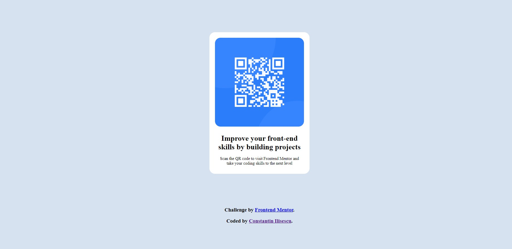

# Frontend Mentor - QR code component solution

This is a solution to the [QR code component challenge on Frontend Mentor](https://www.frontendmentor.io/challenges/qr-code-component-iux_sIO_H). Frontend Mentor challenges help you improve your coding skills by building realistic projects. 

## Table of contents

- [Overview](#overview)
  - [Screenshot](#screenshot)
  - [Links](#links)
  - [Built with](#built-with)
  - [What I learned](#what-i-learned)
  - [Continued development](#continued-development)
  - [Useful resources](#useful-resources)
- [Author](#author)
- [Acknowledgments](#acknowledgments)

## Overview
This was my first project completed on https://www.frontendmentor.io . Completing this challenge gave me confidence on taking new challenges. 

### Screenshot

### Links

- Solution URL: [Add solution URL here](https://constantinilisescu.github.io/qr-code-component-main/)
- Live Site URL: [Add live site URL here](https://constantinilisescu.github.io/qr-code-component-main/)

### Built with

- HTML5
- CSS
- Flexbox

### What I learned

I've learned how to set global variables in css, how to work with flexbox properties, center items, margin, padding. 

If you want more help with writing markdown, we'd recommend checking out [The Markdown Guide](https://www.markdownguide.org/) to learn more.

### Continued development

I would like to further improve my overall programing skills.

### Useful resources

- [Style Stage](https://stylestage.dev/) - This helped me for XYZ reason. I really liked this pattern and will use it going forward.
- [CSSBattle!](https://cssbattle.dev/) - This is an amazing article which helped me finally understand XYZ. I'd recommend it to anyone still learning this concept.
- [Achieve Mastery Through Challenge!](https://www.codewars.com/) 
- [Frontend Practice](https://www.frontendpractice.com/) 
- [FIRST TIMERS ONLY](https://www.firsttimersonly.com/)
- [CODE NEWBIE](https://www.codenewbie.org/)

## Author

- Website - [Constantin ilisescu](https://upbeat-meitner-780c56.netlify.app/)

## Acknowledgments

This challenge is perfect for your first project. Is's simple enough to give you confidence to continue. It took me a few hours to complete. Recommend it for fresh starters. 
